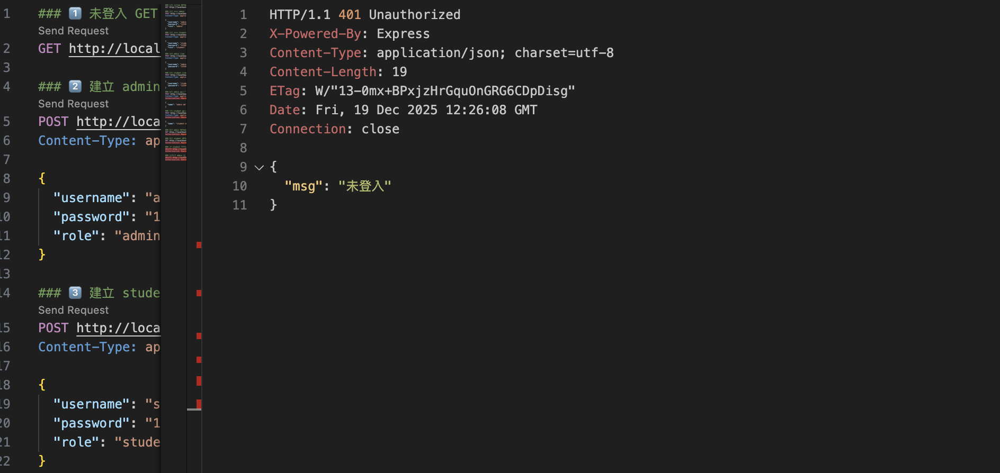
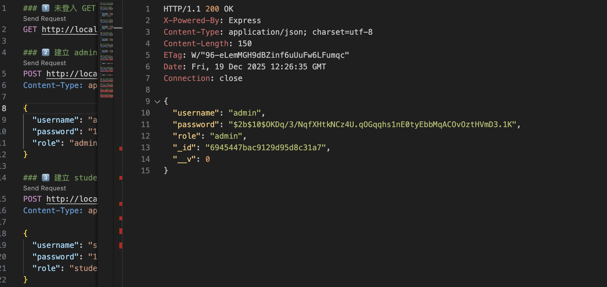
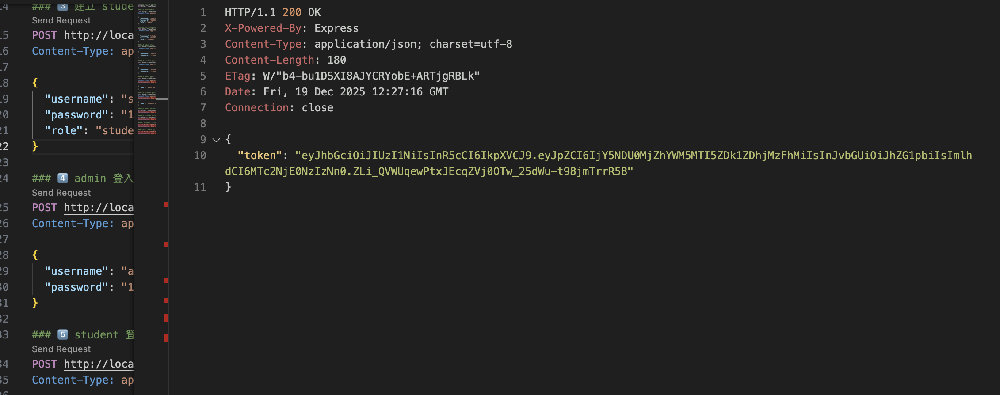
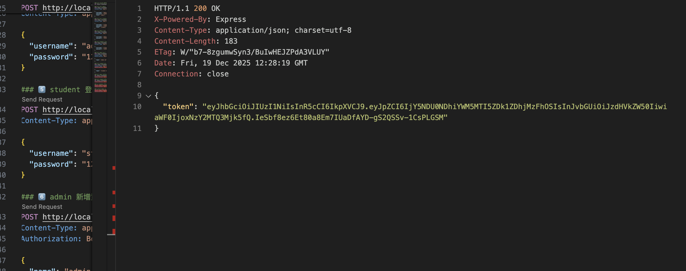

## 啟動後端
進入專案資料夾：
cd week12_lab
安裝套件：
npm install
啟動後端伺服器：
npm run dev
啟動成功後，終端機會顯示：
Server running on http://localhost:3000
MongoDB Memory Server connected
表示後端 API 與 MongoDB 記憶體資料庫已成功啟動。

## API 測試方式
本 Lab 使用 VS Code REST Client 進行 API 測試，測試檔案為：
tests/api.http
測試流程依序為：
未登入狀態存取 API，回傳 401 Unauthorized
建立 admin 與 student 帳號
登入成功後取得 JWT token
帶 token 存取受保護 API
student 權限不足時被拒絕
admin 成功刪除資料
JWT 驗證 Header 範例如下：
http
Authorization: Bearer <JWT_TOKEN>

## API 功能說明
註冊帳號
POST /auth/signup
Request body 範例：
{
  "username": "admin",
  "password": "123456",
  "role": "admin"
}
登入帳號
POST /auth/login
登入成功後會回傳 JWT token：
{
  "token": "xxxx.yyyy.zzzz"
}
受保護 API（/api/signup）
GET /api/signup
登入後才能查詢資料，student 只能查詢自己的資料，admin 可以查詢全部資料。

POST /api/signup
登入後才能新增資料，系統會自動記錄 ownerId 為建立者。

DELETE /api/signup/:id
只有資料擁有者或 admin 角色可以刪除資料。

帳號列表（測試用）
帳號	密碼	角色
admin	123456	admin
student	123456	student

## 截圖區

